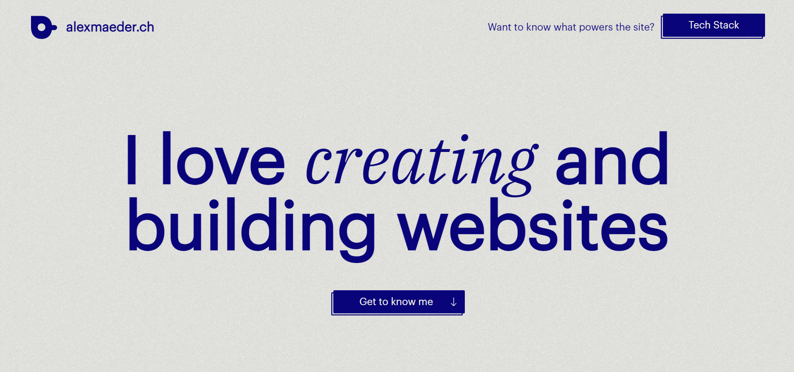
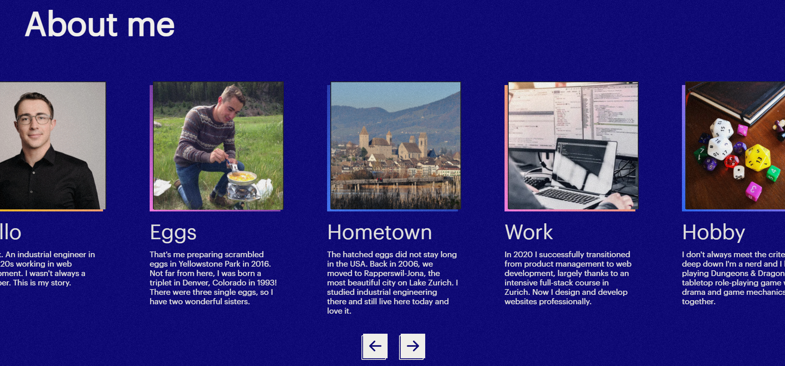
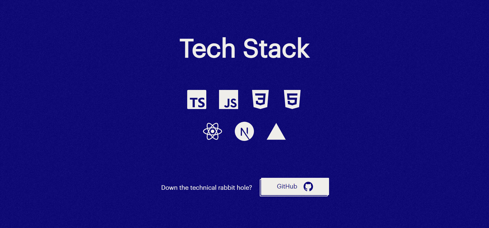

## Purpose

https://alexmaeder.ch is a personal website filled with content about me and my work.

## Impressions

## Installation & Usage

1. Install node: https://nodejs.org/en/download/
2. Update npm: <code>$ sudo npm install -g npm@latest</code>
4. Clone the repository: <code>$ git clone</code> followed by the git snipped (can be copied on github.com)
5. Install all dependencies: <code>$ cd frontend/ $ npm i</code>
6. Start the frontend Next app: <code>$ cd frontend/ $ npm run dev</code>
7. Test if the Next app is running correctly by accessing http://localhost:3000/

## Project Status

As of March 10, 2022, development has slowed to a minimum.